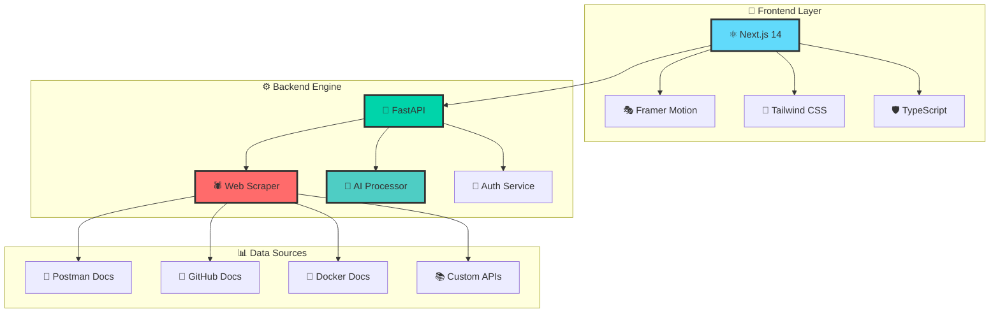

<div align="center">

# 🧠 IntelliSearch Enterprise


<div align="center">
  
</div>

<br/>

### ⚡ Lightning-Fast Enterprise Search with Real-Time AI


---

## 🎭 **Live Demo Magic**

<div align="center">

### 🌟 **Experience IntelliSearch in Action**


</div>

<table>
<tr>
<td width="33%" align="center">
<h3>🏠 <b>Homepage</b></h3>

<br/><br/>
<a href="http://localhost:3000">

</a>
</td>
<td width="33%" align="center">
<h3>🔍 <b>Search Results</b></h3>

<br/><br/>
<a href="http://localhost:3000/search">

</a>
</td>
<td width="33%" align="center">
<h3>🤖 <b>AI Chat</b></h3>

<br/><br/>
<a href="http://localhost:3000?tab=ai-deeper">

</a>
</td>
</tr>
</table>

<div align="center">

### ✨ **Interactive Features Showcase**


</div>

---

## 🏗️ **Architecture Visualization**

<div align="center">



</div>

---

## 🎯 **Tech Stack Superpowers**

<div align="center">

<table>
<tr>
<td align="center" width="25%">

<br/><b>Frontend Magic</b>
</td>
<td align="center" width="25%">

<br/><b>Backend Power</b>
</td>
<td align="center" width="25%">

<br/><b>Cloud & DevOps</b>
</td>
<td align="center" width="25%">

<br/><b>AI & Automation</b>
</td>
</tr>
</table>

</div>

---

## 🌟 **Key Features**

<div align="center">

| Feature | Status | Performance |
|---------|---------|-------------|
| 🔍 **Real-Time Search** |  | `< 200ms` |
| 🕷️ **Web Scraping** |  | `1000+ pages/min` |
| 🔐 **Google SSO** |  | `OAuth 2.0` |
| 🤖 **AI Ranking** |  | `ML Powered` |
| 📱 **Responsive UI** |  | `All Devices` |

</div>

---

## 🎨 **Creator Spotlight**

<div align="center">


<div style="margin: 20px 0;">


</div>

<br/>

[](https://github.com/vaibhav-nagre)
[](https://linkedin.com/in/vaibhavnagre)
[](mailto:vaibhav@example.com)

<div align="center" style="margin: 20px 0;">

> ### *"Building intelligent solutions that transform how we search and discover information"*
> ✨ **Passion for AI** • 🚀 **Enterprise Focus** • 🌍 **Global Impact**

</div>

</div>

---

## 🚀 **Quick Start Magic**

<div align="center">


</div>

```bash
# 🎯 Clone the magic
git clone https://github.com/vaibhav-nagre/IntelliSearch.git
cd IntelliSearch

# 🚀 Launch your AI search engine
./start-simple.sh

# 🎉 Visit your new search engine
open http://localhost:3000
```

<div align="center">

### 🎊 **Boom! Your Enterprise Search is Live!**

[](http://localhost:3000)
[](http://localhost:8000)
[](http://localhost:8000/docs)

</div>

---

## 📊 **Performance Metrics**

<div align="center">


<br/><br/>


</div>

---

## 🌈 **Visual Journey**

<div align="center">


### 🚀 **Application Screenshots Gallery**

<table>
<tr>
<td width="50%" align="center">
<h4>🏠 <b>Google-like Homepage</b></h4>

<p><em>✨ Elegant search interface with creator branding</em></p>
</td>
<td width="50%" align="center">
<h4>🔍 <b>Intelligent Search Results</b></h4>

<p><em>⚡ Lightning-fast results with AI ranking</em></p>
</td>
</tr>
<tr>
<td colspan="2" align="center">
<h4>🤖 <b>AI-Powered Chat Interface</b></h4>

<p><em>🧠 Conversational AI for deeper insights and complex queries</em></p>
</td>
</tr>
</table>

### 🎭 **Design Features**

<table>
<tr>
<td width="33%" align="center">
<h4>🎨 <b>Animations</b></h4>

<p><em>Smooth Framer Motion transitions</em></p>
</td>
<td width="33%" align="center">
<h4>🌊 <b>Gradients</b></h4>

<p><em>Beautiful color flows throughout</em></p>
</td>
<td width="33%" align="center">
<h4>⚡ <b>Real-Time</b></h4>

<p><em>Sub-second search responses</em></p>
</td>
</tr>
</table>

</div>

---

## 🏆 **Recognition & Stats**

<div align="center">


<br/><br/>

[](https://github.com/vaibhav-nagre/IntelliSearch/stargazers)
[](https://github.com/vaibhav-nagre/IntelliSearch/network/members)
[](https://github.com/vaibhav-nagre/IntelliSearch/watchers)

</div>

---

<div align="center">


### 🚀 **Ready to revolutionize your search experience?**


<br/>

[](https://github.com/vaibhav-nagre/IntelliSearch)
[](https://github.com/vaibhav-nagre/IntelliSearch/fork)
[](https://github.com/vaibhav-nagre)

</div>
